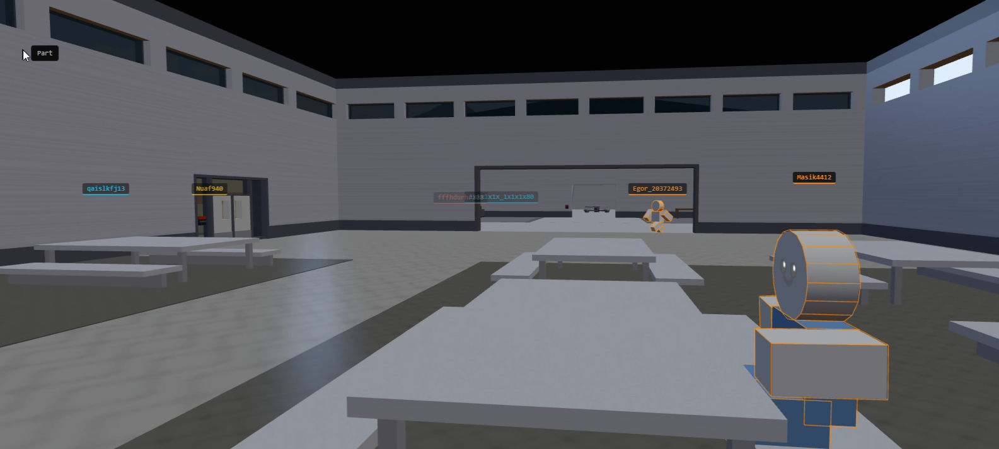
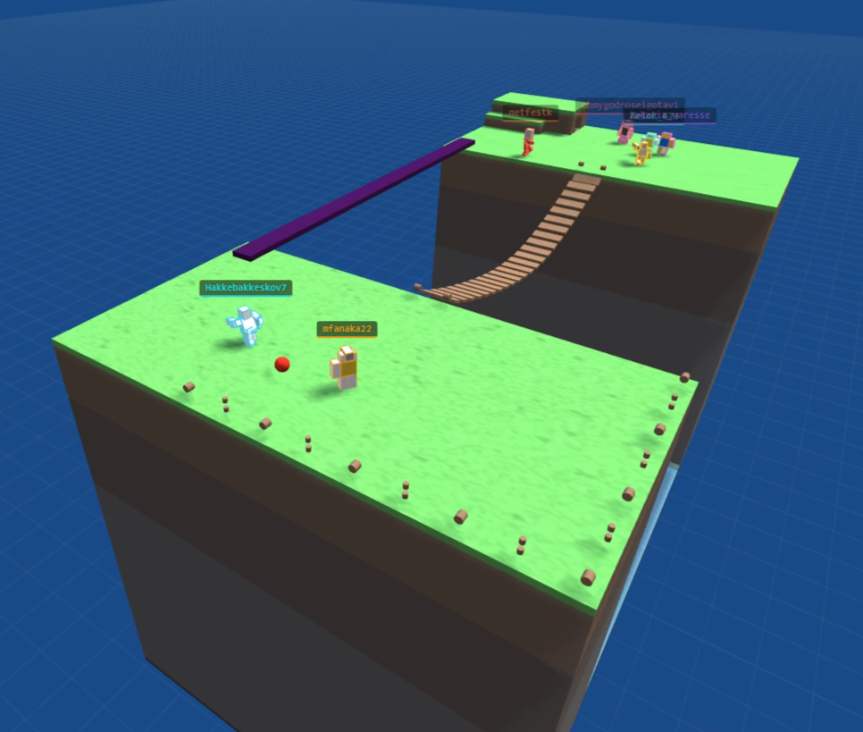

# Roblox Web Engine

A real-time 3D web viewer for Roblox games. Renders game worlds in the browser using Three.js by streaming data from a Roblox executor (Xeno) through a local Node.js server.

## Table of Contents

- [How It Works](#how-it-works)
- [Features](#features)
- [Setup](#setup)
- [Requirements](#requirements)
- [Releases](#releases)
- [Screenshots](#screenshots)
- [Future Updates](#future-updates)

## How It Works

1. **Lua Scanner** (`lua/scanner.lua`) runs in a Roblox executor (Xeno), scans the game world and streams part data, player info, chat, and more to a local server
2. **Node.js Server** (`server/`) receives the data and pushes it to connected browsers via WebSocket
3. **Browser Client** (`public/index.html`) renders everything in 3D using Three.js (WebGL2)

## Features

- Real-time 3D rendering of Roblox game worlds (parts, wedges, cylinders, spheres)
- Player rendering with body colors, cylindrical heads with face textures
- Real player face textures fetched from Roblox
- Procedural material textures (Brick, Wood, Grass, Metal, Concrete, etc.)
- NPC head detection and rendering
- Text labels (BillboardGui / SurfaceGui) with face culling
- Leaderboard rendering on part surfaces
- Skybox loading from game's Lighting
- Roblox-style frosted glass pill UI
- Camera modes: Orbit (mouse drag) and Fly (WASD + mouse)
- Live game chat display
- Player list with follow functionality
- Configurable settings (max parts, scan rate, sky, fog, shadows, grid)
- WebGL 1/2 toggle

## Setup

1. Install [Node.js](https://nodejs.org/)
2. Extract a release zip
3. Run the server:
   ```
   cd server
   npm install
   node index.js
   ```
4. Open `http://localhost:3000` in your browser
5. Execute `lua/scanner.lua` in Xeno while in a Roblox game

## Requirements

- Node.js 18+
- A Roblox executor (Xeno) that supports `http_request`
- A modern browser with WebGL2 support

## Releases

| Version | Changes |
|---------|---------|
| v3 | Three.js r160, WebGL2, skybox, leaderboards, real face textures, NPC heads, text labels, material textures, Roblox-style UI |
| v2.2 | Material textures, player list close/open, face rendering fixes |
| v2.1 | Roblox pill UI, rotation fixes (cylinder/wedge), material texture system |
| v2 | Base version with full 3D rendering, player rendering, chat, settings |

## Screenshots

**Prison Life (v3)**


**Just a Rope Bridge (v2)**


## Future Updates

- **WebGPU renderer** — migrate from WebGL 1/2 to WebGPU for significantly better performance and modern GPU features
- **Proper mesh rendering** — load and render actual MeshPart geometry (cars, furniture, custom models) instead of bounding boxes
- **Decal/texture rendering** — display images on part faces (signs, logos, floor markings)
- **Player clothing** — fetch and render shirt/pants textures on player bodies
- **InstancedMesh batching** — group identical parts into single draw calls for massive FPS gains at high part counts
- **Terrain voxel rendering** — render actual terrain geometry (grass, rock, water) instead of just a bounding box
- **Time of Day sync** — match the game's lighting and sun position in the browser
